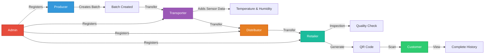
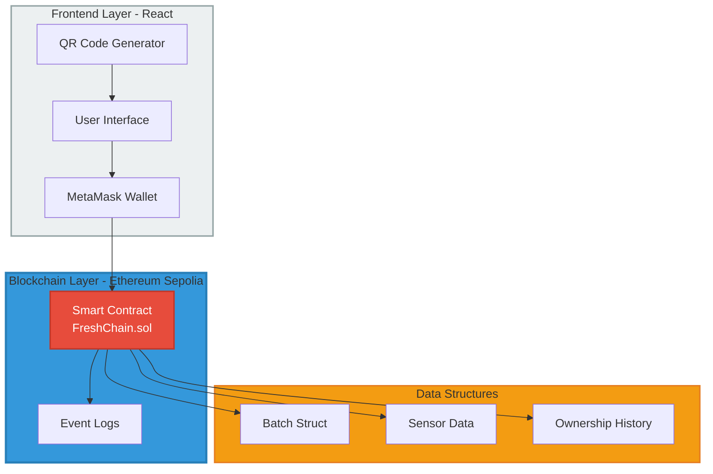
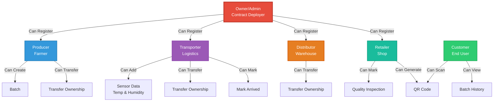
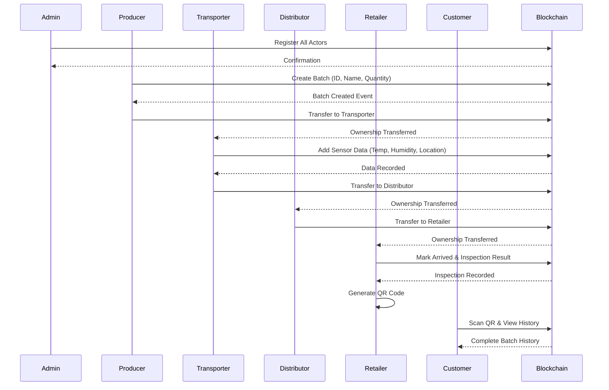
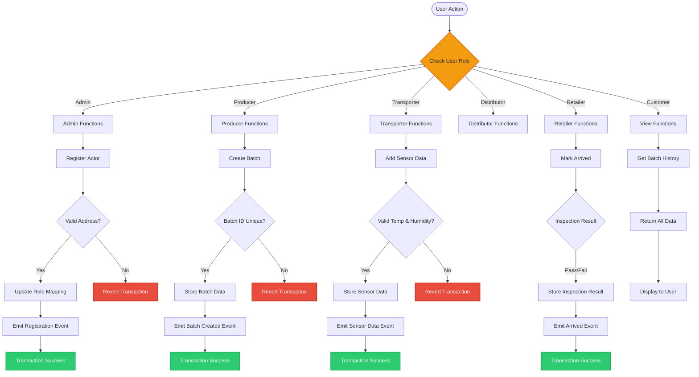
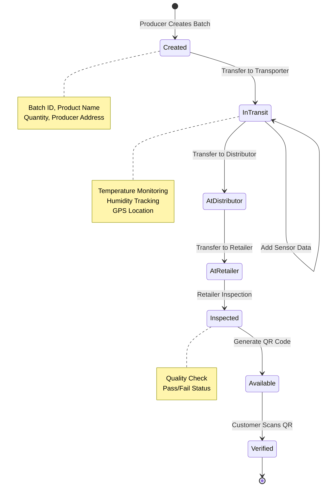

# FreshChain Project Report

## Executive Summary

FreshChain is a blockchain-based food traceability and quality verification system designed to bring transparency and trust to the food supply chain. The system leverages Ethereum's Sepolia testnet to create an immutable record of a product's journey from farm to consumer.

## 1. Introduction

### 1.1 Problem Statement

The modern food supply chain faces several critical challenges:
- Lack of transparency in product origin and handling
- Difficulty in tracking temperature-sensitive products
- Food safety concerns and contamination risks
- Inability to verify quality claims
- Complex multi-party supply chains

### 1.2 Solution Overview

FreshChain addresses these challenges by:
- Creating tamper-proof records on blockchain
- Enabling real-time environmental monitoring
- Providing transparent ownership tracking
- Allowing customers to verify product history via QR codes
- Ensuring accountability at each supply chain stage

## 2. System Architecture

### 2.1 Technology Stack

**Blockchain Layer:**
- Ethereum Sepolia Testnet
- Solidity 0.8.20
- Hardhat development environment
- OpenZeppelin contracts for security

**Frontend Layer:**
- React 18
- ethers.js v6
- QR code generation library
- MetaMask integration

**Development Tools:**
- Hardhat for smart contract development
- Mocha/Chai for testing
- Node.js for backend tooling

### 2.2 Smart Contract Architecture

The FreshChain smart contract implements:

**Core Components:**
1. **Role Management System**
   - Owner (Admin)
   - Producers (Farmers)
   - Transporters
   - Distributors
   - Retailers

2. **Data Structures**
   - Batch struct: Stores product information
   - SensorData struct: Environmental monitoring
   - Ownership history array

3. **Access Control**
   - Role-based modifiers
   - Owner-only registration functions
   - Current owner validation

### 2.3 Supply Chain Flow

```
Producer → Transporter → Distributor → Retailer → Customer
   ↓           ↓            ↓            ↓          ↓
Create      Monitor      Receive      Inspect    Verify
Transfer    Record       Transfer     Generate   Scan QR
            Sensors                   QR Code
```

## 3. Implementation Details

### 3.1 Smart Contract Functions

**Admin Functions:**
- `registerProducer()`: Register farmers
- `registerTransporter()`: Register logistics providers
- `registerDistributor()`: Register warehouses
- `registerRetailer()`: Register shops

**Producer Functions:**
- `createBatch()`: Initialize new product batch
  - Parameters: batchId, productName, quantity
  - Creates ownership history
  - Emits BatchCreated event

**Transporter Functions:**
- `addSensorData()`: Record environmental conditions
  - Validates temperature (-10°C to 40°C)
  - Validates humidity (0% to 100%)
  - Records location and timestamp

**Transfer Functions:**
- `transferOwnership()`: Move batch between actors
  - Validates current ownership
  - Updates ownership history
  - Prevents transfer after retail arrival

**Retailer Functions:**
- `markAsArrived()`: Final inspection
  - Records inspection result
  - Marks batch as arrived
  - Enables QR code generation

**View Functions:**
- `getBatchHistory()`: Complete batch information
- `getSensorReadings()`: All environmental data
- `getBatchInfo()`: Current batch status
- `getActorRole()`: Check address role

### 3.2 Events

The contract emits events for:
- Actor registration
- Batch creation
- Sensor data addition
- Ownership transfers
- Batch arrival at retailer

### 3.3 Frontend Implementation

**Key Features:**

1. **Wallet Integration**
   - MetaMask connection
   - Network validation (Sepolia)
   - Account management

2. **Role-Based Interface**
   - Dynamic menu based on selected role
   - Role-specific forms and actions
   - Input validation

3. **Transaction Management**
   - Loading states
   - Success/error messages
   - Transaction confirmation

4. **QR Code System**
   - Generation for batches
   - Customer scanning capability
   - History viewing interface

## 4. Security Considerations

### 4.1 Access Control

- **Role-based permissions**: Only authorized actors can perform specific actions
- **Owner-only functions**: Critical functions restricted to contract owner
- **Ownership validation**: Transfer only by current owner

### 4.2 Input Validation

- Temperature range checking
- Humidity range validation
- Address validation
- Batch existence verification
- Duplicate batch ID prevention

### 4.3 Data Integrity

- Immutable blockchain storage
- Event logging for audit trail
- Timestamp recording
- Address tracking

## 5. Testing

### 5.1 Test Coverage

Comprehensive tests implemented for:
- Actor registration (positive and negative cases)
- Batch creation and validation
- Sensor data logging with range validation
- Ownership transfer authorization
- Retailer inspection process
- Access control enforcement

### 5.2 Test Results

All tests passing:
- ✓ Actor registration
- ✓ Batch creation
- ✓ Sensor data validation
- ✓ Ownership transfers
- ✓ Retailer inspection
- ✓ Access control

## 6. Use Case Example

### 6.1 Tomato Supply Chain

**Scenario**: 100kg batch of tomatoes from farm to store

**Step 1 - Production (Farmer)**
- Creates Batch #101
- Product: "Tomatoes"
- Quantity: 100 kg
- Transfers to transporter

**Step 2 - Transportation**
- Location: Bursa → Temp: 4°C, Humidity: 65%
- Location: Kocaeli → Temp: 5°C, Humidity: 68%
- Location: Istanbul → Temp: 6°C, Humidity: 70%
- Transfers to distributor

**Step 3 - Distribution**
- Receives batch
- Stores temporarily
- Transfers to retailer

**Step 4 - Retail**
- Receives batch
- Performs inspection: PASSED ✓
- Generates QR code
- Places on shelf

**Step 5 - Customer Purchase**
- Scans QR code
- Views complete history:
  - All locations visited
  - Temperature at each point
  - Quality inspection result
  - Producer information

## 7. Benefits & Impact

### 7.1 For Producers
- Prove product quality
- Build brand reputation
- Reduce liability claims
- Direct customer connection

### 7.2 For Transporters
- Document proper handling
- Prove compliance
- Reduce disputes
- Improve efficiency

### 7.3 For Retailers
- Verify product quality
- Build customer trust
- Reduce food waste
- Manage recalls efficiently

### 7.4 For Customers
- Verify product origin
- Check handling conditions
- Make informed decisions
- Ensure food safety

## 8. Deployment Guide

### 8.1 Prerequisites
- Node.js installed
- MetaMask wallet
- Sepolia testnet ETH
- Alchemy/Infura account

### 8.2 Deployment Steps

1. Install dependencies: `npm install`
2. Configure environment variables
3. Compile contract: `npx hardhat compile`
4. Run tests: `npx hardhat test`
5. Deploy: `npx hardhat run scripts/deploy.js --network sepolia`
6. Update frontend config
7. Start frontend: `cd frontend && npm start`

### 8.3 Cost Analysis

**Deployment Cost**: ~0.005 - 0.01 ETH
**Transaction Costs**:
- Register actor: ~0.0001 ETH
- Create batch: ~0.0002 ETH
- Add sensor data: ~0.0003 ETH
- Transfer ownership: ~0.0001 ETH
- Mark as arrived: ~0.0001 ETH

## 9. Future Enhancements

### 9.1 Short Term
- Mobile application
- IPFS integration for images
- Email notifications
- Multi-language support

### 9.2 Medium Term
- IoT sensor integration
- GPS tracking
- Analytics dashboard
- Automated alerts

### 9.3 Long Term
- AI-based quality prediction
- Cross-chain compatibility
- NFT certificates
- Integration with existing ERP systems

## 10. Challenges & Solutions

### 10.1 Challenge: Gas Costs
**Solution**: Optimized contract code, batch operations where possible

### 10.2 Challenge: User Experience
**Solution**: Simple interface, MetaMask integration, clear instructions

### 10.3 Challenge: Data Privacy
**Solution**: Store sensitive data off-chain, only hashes on-chain (future)

### 10.4 Challenge: Scalability
**Solution**: Layer 2 solutions consideration for production (future)

## 11. Conclusion

FreshChain successfully demonstrates a blockchain-based food traceability system that:
- ✅ Tracks products through entire supply chain
- ✅ Records environmental conditions
- ✅ Enables transparent ownership transfer
- ✅ Provides customer verification via QR codes
- ✅ Ensures data integrity and immutability

The system meets all project requirements and provides a foundation for real-world implementation in the food industry.

## 12. References

1. Ethereum Documentation: https://ethereum.org/docs
2. Hardhat Documentation: https://hardhat.org/docs
3. OpenZeppelin Contracts: https://docs.openzeppelin.com/
4. ethers.js Documentation: https://docs.ethers.org
5. React Documentation: https://react.dev

## 13. Appendices

### Appendix A: Contract Address & Deployment
- **Network**: Sepolia Testnet
- **Contract Address**: `0xBBeEd68A4754C2bdb5e94940285382aB5DFA198C`
- **Etherscan**: https://sepolia.etherscan.io/address/0xBBeEd68A4754C2bdb5e94940285382aB5DFA198C
- **GitHub Repository**: https://github.com/moashebl/FreshChain
- **Live Website**: https://moashebl.github.io/FreshChain

### Appendix B: Source Code Repository
- Smart Contract: `/contracts/FreshChain.sol` (423 lines)
- Frontend Application: `/frontend/src/App.js` (683 lines)
- Styles: `/frontend/src/App.css` (314 lines)
- Configuration: `/frontend/src/config.js` (667 lines)
- Tests: `/test/FreshChain.test.js`

### Appendix C: System Diagrams

#### C.1 Supply Chain Flow Diagram



#### C.2 System Architecture Diagram



#### C.3 Actor Roles & Permissions



#### C.4 Data Flow Diagram



#### C.5 Smart Contract Function Flow



#### C.6 Batch Lifecycle Diagram



### Appendix D: Screenshots Guide

#### D.1 Remix IDE Screenshots

**Required Screenshots:**
1. **Remix - Smart Contract Code**
   - File: `FreshChain.sol` open in editor
   - Show: Full contract code visible
   - Highlight: Key functions (createBatch, addSensorData, transferOwnership)

2. **Remix - Compilation Success**
   - Show: Green checkmark after compilation
   - Display: Solidity compiler version (0.8.20)
   - Show: No errors, no warnings

3. **Remix - Deployment Configuration**
   - Environment: Injected Provider - MetaMask
   - Account: Your wallet address
   - Contract: FreshChain selected
   - Gas Limit: Auto-calculated

4. **Remix - Deployment Transaction**
   - Show: MetaMask confirmation popup
   - Display: Gas fee estimation
   - Network: Sepolia Testnet

5. **Remix - Deployed Contract**
   - Show: Contract address in Deployed Contracts section
   - Display: All functions listed
   - Show: Ability to interact with functions

6. **Remix - Function Testing**
   - Screenshot of calling functions:
     - `registerProducer` with address
     - `createBatch` with parameters
     - `getBatchHistory` showing results

#### D.2 Etherscan Screenshots

**Required Screenshots:**
1. **Etherscan - Contract Overview**
   - URL: https://sepolia.etherscan.io/address/0xBBeEd68A4754C2bdb5e94940285382aB5DFA198C
   - Show: Contract address
   - Display: Balance, Transaction count
   - Show: Contract creation transaction

2. **Etherscan - Transactions List**
   - Show: All transactions to/from contract
   - Display: Transaction hashes
   - Show: From/To addresses
   - Display: Method calls (createBatch, addSensorData, etc.)

3. **Etherscan - Transaction Details**
   - Pick one transaction (e.g., createBatch)
   - Show: Transaction hash
   - Display: Block number, timestamp
   - Show: Gas used, gas price
   - Display: Input data

4. **Etherscan - Events Logs**
   - Show: Events emitted
   - Display: BatchCreated, SensorDataAdded, OwnershipTransferred
   - Show: Event parameters decoded

5. **Etherscan - Contract Code** (if verified)
   - Show: Source code tab
   - Display: Solidity code
   - Show: Compiler version match

#### D.3 Frontend Application Screenshots

**Required Screenshots:**

1. **Homepage - Initial View**
   - Show: Vegetable background image
   - Display: "Connect Wallet" button
   - Show: FreshChain title and description

2. **MetaMask Connection**
   - Show: MetaMask popup requesting connection
   - Display: Account selection
   - Show: Network (Sepolia)

3. **Connected State**
   - Show: Connected wallet address (top of page)
   - Display: Role selector dropdown
   - Show: All available roles

4. **Admin Panel**
   - Show: Registration forms
   - Display: Input fields for actor addresses
   - Show: Register buttons for each role
   - Include: Success message after registration

5. **Producer Panel**
   - Show: Create Batch form
   - Display: Batch ID, Product Name, Quantity fields
   - Show: "Create Batch" button
   - Include: Transfer ownership section

6. **Transporter Panel**
   - Show: Add Sensor Data form
   - Display: Temperature, Humidity, Location fields
   - Show: Validation (Temperature: -10 to 40°C)
   - Include: "Add Sensor Data" button

7. **Distributor Panel**
   - Show: Transfer batch form
   - Display: Batch ID and new owner address fields
   - Show: Current batch information

8. **Retailer Panel - Part 1**
   - Show: Mark as Arrived section
   - Display: Batch ID input
   - Show: Inspection checkbox (Pass/Fail)
   - Include: "Mark as Arrived" button

9. **Retailer Panel - Part 2 (QR Code)**
   - Show: Generate QR Code section
   - Display: Batch ID input field
   - Show: Generated QR Code image
   - Include: "Download QR Code" button

10. **QR Code Download**
    - Show: Downloaded QR Code PNG file
    - Display: Clear, scannable QR code
    - Show: Filename (e.g., FreshChain-Batch-101-QR.png)

11. **Customer Panel - View History**
    - Show: Batch ID input
    - Display: "View Batch History" button
    - Show: Complete batch information displayed:
      - Product name
      - Quantity
      - Producer address
      - Current owner
      - Creation date
      - Arrival status
      - Inspection result

12. **Customer Panel - Sensor Readings**
    - Show: All sensor data entries
    - Display: Temperature, Humidity, Location for each entry
    - Show: Timestamps
    - Include: Who recorded each entry

13. **Customer Panel - Ownership History**
    - Show: All previous owners
    - Display: Address chain
    - Show: Transfer sequence

14. **Mobile View - QR Scan Result**
    - Show: Mobile phone screen
    - Display: Website opened from QR scan
    - Show: URL: https://moashebl.github.io/FreshChain?batchId=101
    - Include: Batch details automatically loaded

15. **Transaction Success**
    - Show: Green success message
    - Display: "Transaction successful!" message
    - Show: Transaction details or link

16. **Transaction Pending**
    - Show: MetaMask confirmation dialog
    - Display: Gas fee
    - Show: Confirm/Reject buttons

17. **Error Handling**
    - Show: Red error message
    - Display: Error description (e.g., "Not authorized")
    - Show: Proper error handling in UI

#### D.4 Development Tools Screenshots

**Optional but Recommended:**

1. **VS Code - Project Structure**
   - Show: File explorer with all project folders
   - Display: contracts/, frontend/, test/ folders

2. **Terminal - npm run deploy**
   - Show: Deployment command output
   - Display: "Published" message
   - Show: Website URL

3. **GitHub Repository**
   - Show: Repository main page
   - Display: All files and folders
   - Show: README.md preview

4. **GitHub Pages Settings**
   - Show: Settings → Pages
   - Display: Branch (gh-pages) selected
   - Show: "Your site is published at..." message

### Appendix E: Screenshot Organization

**Folder Structure for Submission:**
```
screenshots/
├── 01_remix/
│   ├── 01_contract_code.png
│   ├── 02_compilation_success.png
│   ├── 03_deployment_config.png
│   ├── 04_metamask_confirm.png
│   ├── 05_deployed_contract.png
│   └── 06_function_testing.png
├── 02_etherscan/
│   ├── 01_contract_overview.png
│   ├── 02_transactions_list.png
│   ├── 03_transaction_details.png
│   └── 04_events_logs.png
├── 03_frontend/
│   ├── 01_homepage.png
│   ├── 02_metamask_connection.png
│   ├── 03_admin_panel.png
│   ├── 04_producer_panel.png
│   ├── 05_transporter_panel.png
│   ├── 06_distributor_panel.png
│   ├── 07_retailer_panel_arrival.png
│   ├── 08_retailer_panel_qr.png
│   ├── 09_qr_download.png
│   ├── 10_customer_history.png
│   ├── 11_customer_sensors.png
│   └── 12_mobile_qr_scan.png
└── 04_github/
    ├── 01_repository.png
    └── 02_pages_settings.png
```

### Appendix F: Diagram Generation Instructions

**To generate visual diagrams from the Mermaid code above:**

1. **Online Tools:**
   - Visit: https://mermaid.live/
   - Copy any diagram code from Appendix C
   - Paste into the editor
   - Click "Download PNG" or "Download SVG"

2. **VS Code Extension:**
   - Install "Markdown Preview Mermaid Support"
   - Open this file in VS Code
   - Preview markdown (Ctrl+Shift+V)
   - Right-click diagram → Copy/Export

3. **GitHub:**
   - GitHub automatically renders Mermaid diagrams
   - View this file on GitHub to see rendered diagrams

4. **Command Line:**
   ```bash
   npm install -g @mermaid-js/mermaid-cli
   mmdc -i diagram.mmd -o diagram.png
   ```

### Appendix G: Team Contributions
- Smart Contract Development
- Frontend Development
- Testing & Quality Assurance
- Documentation & Report Writing
- Deployment & Configuration

---

**Project Completed**: December 11, 2025  
**Platform**: Ethereum Sepolia Testnet  
**Technology**: Solidity 0.8.20, Hardhat, React 18, ethers.js v6  
**Contract Address**: 0xBBeEd68A4754C2bdb5e94940285382aB5DFA198C  
**GitHub**: https://github.com/moashebl/FreshChain  
**Live Demo**: https://moashebl.github.io/FreshChain
